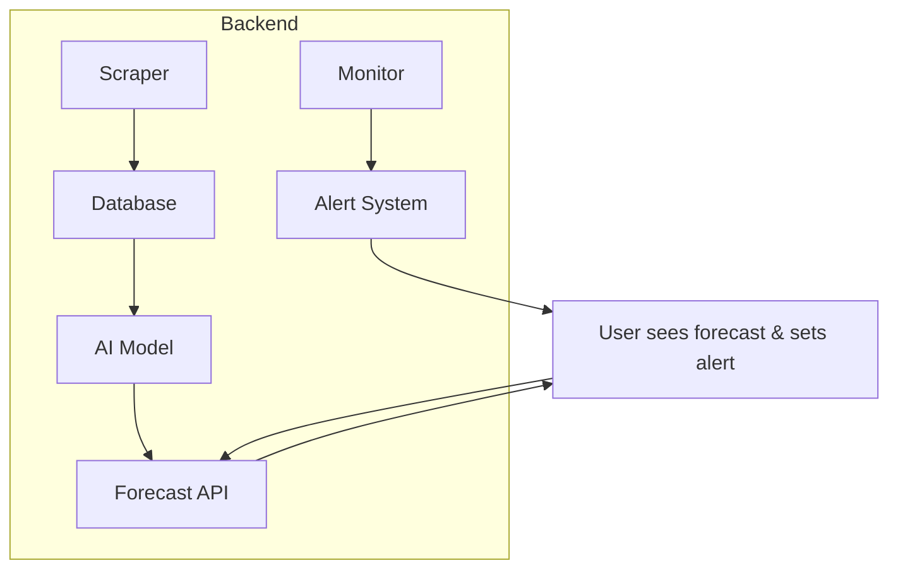

# AI Price Forecast

## Overview of the Capability

**What it does:**  
AI Price Forecast gives shoppers a short-term (7-day) predictive view of a product’s price trajectory and turns that signal into clear, actionable guidance—e.g., “Buy now,” “Wait ~2 days for ~5% drop,” or “Price likely stable.” Users can set a target price and opt into alerts; the system notifies them when current or forecasted conditions meet their goal.

**User value:**  
Reduces hesitation and decision friction by replacing guesswork with data-driven timing advice. Personalized tracking and alerts keep users engaged without forcing constant manual checking.

**Key components:**  
- **Data ingestion:** Continuously collects historical prices, stock/seller signals, past promotion patterns, and calendar context (holidays, seasonality).  
- **Forecasting engine:** Machine learning models predict the price path over the next week, estimating direction and magnitude.  
- **Signal generation:** Converts raw forecasts into user-facing recommendations with confidence indicators.  
- **Tracking & alerting:** Allows users to specify a desired price; monitors real-time and predicted prices and sends notifications when thresholds are met.  


## Assumptions and Dataset
- **Data acquisition:** In a full system, prices and availability would be fetched live from Zap/merchant pages using web scraping (e.g., BeautifulSoup with proper pagination, headers, retries, and optional headless rendering); in this prototype we simplified by hardcoding query parameters and sample data to keep scope small and focus on the forecasting/alert logic.
- **Notifications:** Prototype uses a Telegram bot with hardcoded tokens for simplicity and speed—it's easy to wire up, delivers instantly, and can target any user for demo purposes. In a full system, the same alert logic is channel agnostic: you could send via email, SMS, push/web app notification, WhatsApp, etc., with proper validation of the user’s contact (phone, email, device token) and user preference.
- **Forecasting:** Prototype uses a simple autoregressive LinearRegression on the last 7 days to predict the next week. With the rich, years long price and behavior data ZAP has accumulated (including seasonality, promotions, seller patterns, stock signals, etc.), we can build far more robust, best fit models—e.g., ensembles of time series learners, gradient boosted regressors, or Bayesian structural models—that capture uncertainty and adapt per SKU.
- **Currency/context:** Prices are in Israeli shekels (₪). For the prototype demonstration we use a TV product (e.g., a 55" model) on a Zap style marketplace to illustrate the forecasting and alert workflow. 
- **Dataset:** Historical daily price data with features:  
  - `date`, `price`  
  - Temporal features: `year`, `month`, `day`, `quarter`  
  - Flags: `discount` (whether a discount was active), `is_weekend`, `is_holiday`  
  - `discounted_price` when applicable  
## Architecture Diagram



## Example User Flow
1. User navigates to a product search page and clicks the `ZAP Price Forecast` button.  
2. Frontend requests a 7-day forecast from the backend.  
3. Backend computes predictions using recent price history and returns them.  
4. User sees the chart, enters a desired price and contact, and submits.  
5. Backend starts a background worker `notify_user` that (stub) waits, evaluates, and sends a price drop alert via Telegram when conditions are simulated to be met.  
6. User receives the alert and decides to purchase.

## Known Limitations
- Forecast model is naive (retrained on every request, simple linear regression) and can be unstable or inaccurate.  
- Current price is hardcoded; no live price fetching from the actual marketplace for real time comparison.  
- Alert logic is a stub (fixed delay and hardcoded alert content).  
- No real validation or deduplication of inputs (phone number, target price).  
- Telegram credentials are embedded (security risk).  
- No user authentication, rate limiting, or abuse protection.  
- Scalability concerns: per request retraining and no robust task queue for alerts.  
- **Business risk:** Users who see a predicted price drop may leave the site to wait for the alert and then buy the item elsewhere if the drop doesn’t materialize quickly, losing immediate conversion and loyalty.  
  **Mitigation:** Surface forecasts and “wait” recommendations selectively (e.g., to pro users, deal seekers, or users explicitly asking for price optimization), add consider value preserving guarantees (like price match or limited time hold) to retain intent.


## Ideas for Future Improvements
- Replace synthetic data with real Zap price history scraper and live current price API.  
- Upgrade forecasting: batch-train models offline (e.g., Prophet, Holt-Winters, gradient boosting ensembles) and add confidence bands.  
- Persist subscriptions in a database; support retry logic and scheduled polling or change detection.  
- Expand notification channels: SMS, email, in-app, and user preferences.  
- Introduce user accounts and saved watchlists.  
- Surface forecast reliability (confidence score) and historical accuracy.   
- Secure secrets via env vars, rotate tokens, and add audit logging.  
- Add fallbacks (e.g., if insufficient history, show heuristic or “insufficient data” with guidance).  
- Integrate with product comparison or “AskZap” conversational assistant for richer decision support.
- **Tests**
  -  A/B test different deal presentations (target price, discount percent, or both) to optimize click-through and conversion rates.
  -  A/B test “tracking” vs. “no tracking”: compare users who can set price alerts and receive proactive notifications against users who only see the forecast, to measure the incremental impact of the tracking/alert feature on conversion and decision speed.  


## Note
There are many promising AI ideas that could enhance the Zap system. One core e-commerce problem is shoppers leaving without purchasing and not returning; by letting them track prices and receive alerts, we can re-engage those users. The features implemented here were chosen for their immediate business value and creative differentiation, with deliberate restraint to avoid overwhelming users. Rather than dumping raw data on shoppers, the prototype distills price history and trends into a single high-impact signal: “Should I buy now or wait?” This focused slice shows how passive price watching becomes proactive decision support, delivering clarity and confidence without cognitive clutter.

## How to Run (Prototype)
```bash
# Clone repo
git clone <your-repo-url>
cd App

# Create and activate virtualenv
python3.11 -m venv venv                   
# macOS / Linux:
source .venv/bin/activate
# Windows:
venv\Scripts\activate

# Install dependencies
python -m pip install --upgrade pip
pip install -r requirements.txt

# Edit `utils.py` and set your Telegram credentials:
# near the top of utils.py
TELEGRAM_TOKEN   = "your_bot_token_here"
TELEGRAM_CHAT_ID = "your_chat_id_here"

# Run the app
python app.py

